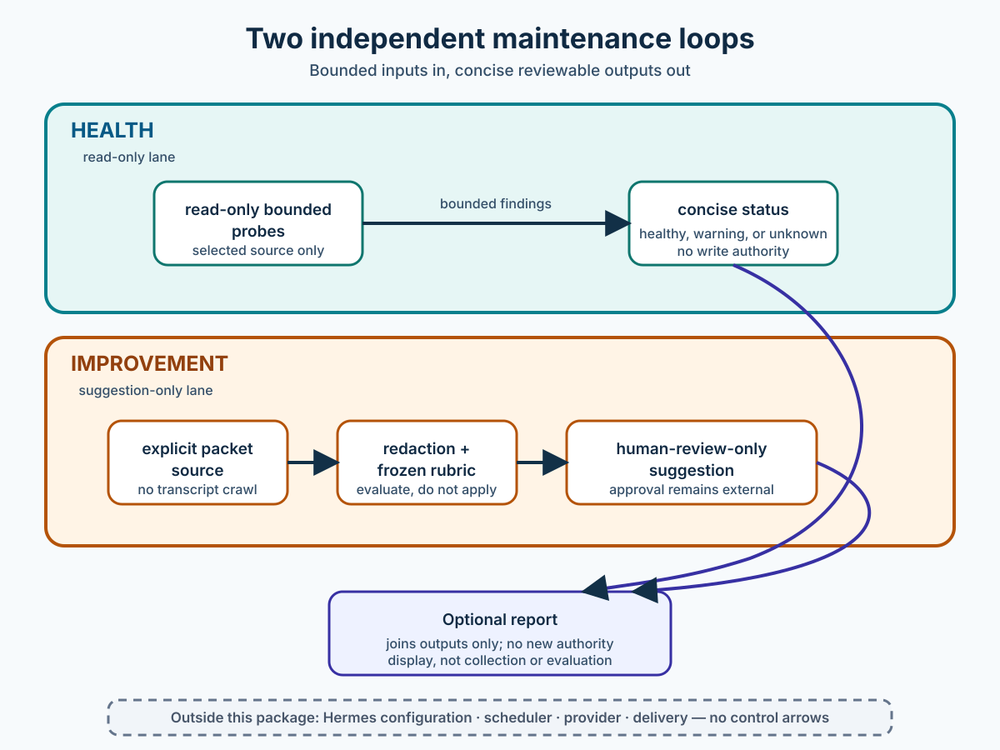

> Part of the hermes-loops monorepo.

# Hermes Maintenance Loops

Hermes Maintenance Loops is a read-only checkup and improvement-notes tool for a Hermes setup. It does not change the setup. Its health check looks for bounded signs such as missing expected files, old session records, low disk space, inaccessible state data, warning patterns in selected logs, and visible trouble signs in supported scheduled-job metadata. It returns a short report showing what looks okay, needs attention, cannot be checked, or is unclear.



The project is not an official Hermes Agent or Nous Research product, and it is not endorsed by either organization.

## In plain English

This project has two independent functions:

- **Health is a dashboard or checkup.** It observes a selected Hermes setup and reports what it can see. It does not repair anything.
- **Improvement is a notebook.** It takes outcome records that a person explicitly provides after they have been redacted, then writes suggestions for that person to review. It does not search for records on its own or make decisions.

## What the health check looks for

For the selected Hermes setup, the health check uses an explicit, bounded checklist:

- whether expected core files are present;
- whether selected session-record metadata is older than 30 days (not session contents);
- whether the disk holding the selected Hermes setup is at least 90% full;
- whether the selected state database can be opened read-only for a simple safe check;
- whether selected bounded logs contain repeated error, timeout, stuck, or stall signals alongside tool activity, clearly marked as a clue rather than proof; and
- whether supported scheduled-job metadata is missing, malformed, unavailable, overdue, blocked before run, failed during execution, has delivery or side-effect trouble, or has repeat failures with a confirmed matching job identity.

It does not look at everything: it does not recursively crawl the machine, read all chat or session content, inspect credentials or private memory, validate every Hermes feature, or attempt to verify network services. It only examines the selected and bounded surfaces described above.

### Example report

```text
HEALTH CHECK — synthetic example only
state database       healthy       opened read-only; simple check passed
storage               warning       selected disk is near the 90% threshold
scheduled-job metadata unavailable  supported metadata could not be read
selected logs         warning       repeated timeout/stall pattern near tool activity; clue, not proof
```

Examples are illustrative and synthetic; this report is not copied from a live system. Read each status as a bounded finding, not as a claim about the whole machine or Hermes.

## What you get

The health check gives you a list of findings with statuses such as:

- healthy: the bounded check found what it expected;
- warning: something deserves attention;
- unavailable: the check could not access an expected source; or
- unknown: the available information was not enough to decide.

Separately, the improvement function can give human-review-only suggestions based on explicitly supplied, redacted outcome records.

A warning is not a repair. Unavailable or unknown does not mean healthy. A good result is not a guarantee that every part of Hermes is perfect; it only describes the bounded checks that were able to run.

## A typical use

1. Choose the Hermes setup you want to inspect.
2. Run the health check and read its report.
3. If recurring outcomes were deliberately provided, read the suggestions and decide whether to investigate.

## What the two loops do

### Health loop

The health loop performs bounded, read-only probes against a Hermes home selected by the operator. It checks available metadata, selected JSON and log content, and supported SQLite state without opening the source for writing. It returns concise structured findings such as healthy, warning, unavailable, or unknown. Missing optional surfaces are reported rather than treated as permission to modify anything.

See [Health check matrix](docs/health-check-matrix.md) for the authoritative technical inventory: the exact list of checks, limits, and source-level behavior.

The health-check matrix contains every current supported detail and limit. Examples are illustrative; the matrix and the selected, bounded surfaces define the actual scope.

### Improvement loop

The improvement loop accepts an explicitly supplied outcome packet or fixture file. It does not search a home or crawl transcripts. The packet is redacted before evaluation, then a frozen rubric turns repeated or notable outcomes into a concise suggestion for human review. It never approves, applies, or schedules a suggestion.

The loops stay separate because their inputs, permissions, failure handling, and runtime state are different. An optional report can place already-produced health and improvement results next to each other, but it does not merge their inputs or grant either loop additional authority.

## What it never does

This package never:

- makes changes to a Hermes home, configuration, scheduler, provider, model, or delivery system;
- restarts, repairs, or schedules anything;
- chooses provider, model, route, host, delivery, or schedule values for an operator;
- reads credentials, authentication files, private memories, raw transcripts, or personal profiles;
- recursively discovers improvement sources;
- automatically approves or applies an improvement proposal; or
- creates a network remote or publishes a release.

Runtime ledgers, suggestions, and installation manifests belong in an external, operator-selected runtime directory. They are not repository source artifacts.

## Install and run

Python 3.10 or newer is required. The package uses only the Python standard library at runtime.

From a checkout or source archive:

```bash
python3 -m pip install .
```

Run the health loop with an operator-selected Hermes home:

```bash
hermes-maintenance-loops health --hermes-home path/to/hermes-home
```

Run the improvement loop with an explicitly supplied JSON packet and an external runtime directory:

```bash
hermes-maintenance-loops improvement \
  --source path/to/outcomes.json \
  --runtime-dir path/to/package-runtime
```

The optional report command combines results that were requested in the same invocation:

```bash
hermes-maintenance-loops report --hermes-home path/to/hermes-home --source path/to/outcomes.json
```

Paths above are examples only; supply locations that are appropriate for your environment. See [Install and scheduling](docs/install.md) for the dry-run boundary, [Architecture](docs/architecture.md) for the data flow, [Privacy](docs/privacy.md) for limitations, and [Testing](docs/testing.md) for verification commands.

Scheduling is intentionally non-operational: the package can render review material, but it does not create or change scheduled jobs. Any later scheduling decision is outside this package and remains a separate human-reviewed operation.

## Security and privacy limitations

The package bounds probes and redacts common secret-like values, contact information, paths, URLs, and opaque tokens. Redaction is not a proof that every possible personal-data format has been removed. Review supplied fixtures and generated artifacts before sharing them. Do not put live runtime data in the source tree.

## License

Released under the [MIT License](LICENSE).
